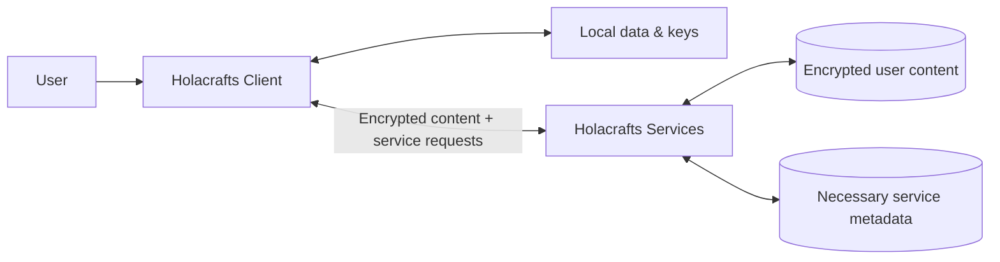
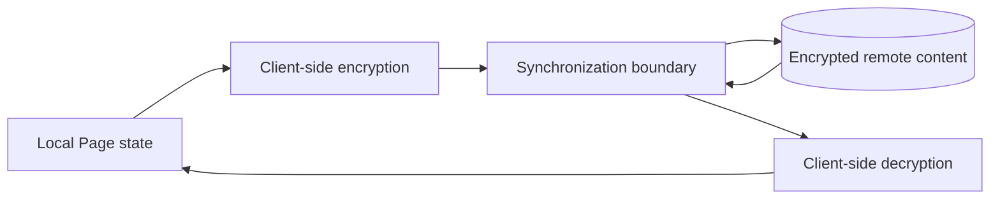

# Holacrafts Architecture

## Overview

Holacrafts is a **local-first, end-to-end encrypted workspace** built around user-owned Spaces and structured Pages.

The architecture is designed around three complementary properties:

- **Local possession** — data already stored on a user's device remains locally available to the Holacrafts app without requiring continuous access to Holacrafts servers.
- **End-to-end encryption** — protected content is encrypted on the client before synchronization and decrypted on authorized clients.
- **User-controlled access** — users decide whether content remains private, is shared with intended recipients, or is explicitly published.



The Holacrafts client is not a thin view over server-owned application state. It maintains the Page model, local state, rendering, cryptographic context, key material, and lifecycle handling required for the user's workspace.

## Core product model

```text
Space
  └── Page
       ├── Element
       ├── Element
       └── Element
```

### Space

A Space is the main user-owned workspace in Holacrafts. It provides the context in which Pages, local application data, access, cryptographic material, and synchronization state are managed.

### Page

A Page is a structured entity inside a Space.

Pages can remain private, be shared with intended recipients, or be explicitly made available through a Public Link.

### Element

Elements are the building blocks of Pages. They give Page content explicit structure and semantics while remaining part of the normal Page lifecycle.

## Local-first runtime

Holacrafts keeps the local application runtime separate from remote synchronization.

```text
Holacrafts Client
        |
        +-- local data
        +-- local cryptographic material
        +-- Page runtime
        +-- rendering
        +-- user interaction
        +-- lifecycle handling
                |
                v
        synchronization boundary
                |
                v
        Holacrafts Services
```

Data already stored locally does not require a server round-trip to remain available in the Holacrafts app. If Holacrafts services are temporarily unavailable, the local copy remains on the device and can still be opened locally.

Server availability is required for network-dependent operations such as synchronization, remote sharing, invitations, and publication.

## Page lifecycle

Holacrafts maintains explicit lifecycle semantics around structured content, including Pages and Drafts.

A Draft is part of the application lifecycle rather than a separate server-owned document model. Creating, editing, saving, converting, sharing, and publishing structured content remain application responsibilities.

This keeps the Page model consistent across local work, synchronization, and externally initiated creation flows.

## Client and synchronization boundary

The Holacrafts client is responsible for the protected user-content runtime and client-side cryptographic operations.

Protected content is encrypted before it crosses the synchronization boundary. Holacrafts infrastructure stores and transfers encrypted user content together with the service metadata required to operate synchronization, delivery, access, and publication.



This separation allows Holacrafts services to support synchronization without becoming the primary plaintext runtime for protected user content or the only place where a user's workspace exists.

## Runtime separation

Serialized Page structure is not the whole Holacrafts runtime.

Responsibilities such as these remain separate from the Page's structured content:

- cryptographic key handling;
- encryption and decryption;
- access and permissions;
- synchronization state;
- message persistence;
- Activity and notifications;
- sharing and publication;
- navigation and lifecycle orchestration.

This separation keeps structured content explicit without duplicating the systems that control its security, persistence, access, and lifecycle.

## Access modes

Holacrafts distinguishes between **Private**, **Invite / Shared**, and **Public Link** access.

Encryption and access are separate concerns. Sharing a Page does not by itself make it public, and public publication is always an explicit user-controlled action.

### Private

Private content remains available to its owner and is not shared with another recipient.

### Invite / Shared

A Page can be shared with an intended recipient without making it public.

Private sharing between established Holacrafts contacts uses recipient-specific end-to-end encrypted key exchange.

For a first invitation to a new contact, a temporary access key is relayed to establish the connection and is not retained as a persistent Holacrafts server secret. Subsequent private sharing uses end-to-end encryption.

### Public Link

Public-link access is a separate, explicit sharing mode.

The client creates the cryptographic material required for public access. The secret required to open the encrypted content is carried with the complete link shared by the user and is not provided to Holacrafts servers as part of the server-side Page data.

This allows Holacrafts infrastructure to serve encrypted published content without possessing the complete cryptographic capability represented by the shared link.

## Architectural boundary

At a high level:

**The client owns the workspace runtime. Holacrafts services provide the network layer around it.**

The client owns local state, rendering, lifecycle behavior, and cryptographic operations. Remote services provide synchronization, delivery, account and access services, sharing, and publication while handling the service metadata necessary for those operations.

For the security guarantees and their boundaries, see [SECURITY.md](SECURITY.md) and [THREAT_MODEL.md](THREAT_MODEL.md).
