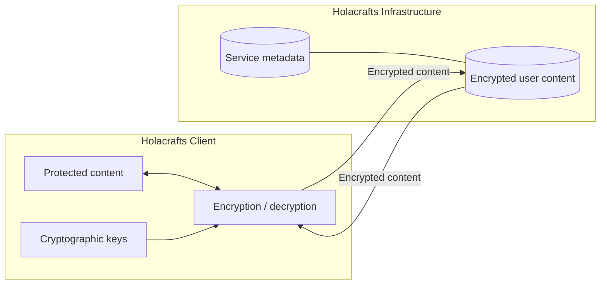
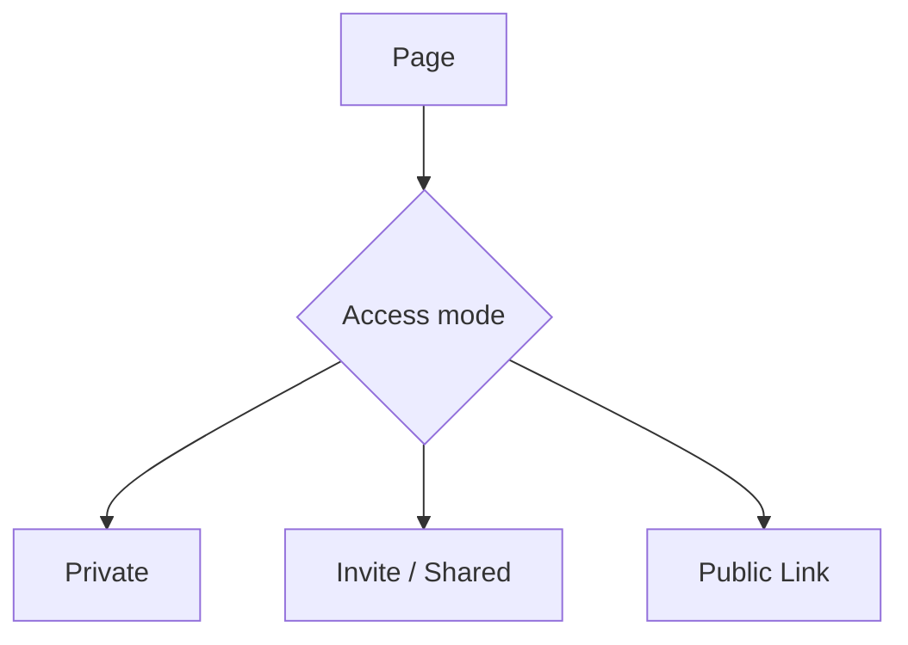

# Holacrafts Security & Privacy

## Security model

Holacrafts is a **local-first system built around privacy, end-to-end encryption, and user-controlled access**.

Protected content is encrypted on the client before synchronization and decrypted on an authorized client. Data already stored on a user's device remains locally available to the Holacrafts app without requiring continuous access to Holacrafts servers.

The model combines:

- **Local-first access** — data already stored on the device remains available locally.
- **End-to-end encryption** — protected content is encrypted before synchronization and decrypted on authorized clients.
- **User-controlled access** — users choose whether content remains private, is shared with a contact, or is explicitly published through a Public Link.

## End-to-end encryption

Protected Page content, Elements, messages, and attachments are encrypted on the client before synchronization.

Private sharing between established Holacrafts contacts uses recipient-specific end-to-end encrypted key exchange. The private cryptographic keys required for this exchange remain with the participating clients.

## Client and server boundary

The Holacrafts client is responsible for:

- generating and handling cryptographic keys;
- encrypting protected content before synchronization;
- decrypting protected content after retrieval;
- preparing recipient-specific cryptographic access for established contacts;
- maintaining the user's locally stored application data.

Holacrafts infrastructure provides synchronization, delivery, authentication, authorization, sharing, publication, and other network-dependent services.

The infrastructure stores and relays encrypted protected content together with the service metadata required to operate those services.

## Authentication, authorization, and cryptographic access

Holacrafts treats these as separate concerns.

**Authentication** identifies a user or client.

**Authorization** determines what that user or client is permitted to do.

**Cryptographic access** determines whether protected content can be decrypted.

Server authorization alone does not provide the cryptographic material required to decrypt protected content.

## Access modes

Holacrafts separates private content, recipient sharing, and public publication.

### Private

Private content remains available to the owner and is not shared with another recipient.

### Invite / Shared

A Page can be shared with an intended recipient without making it public.

Private sharing between established Holacrafts contacts uses end-to-end encrypted key exchange.

For a first invitation to a new contact, a temporary access key is relayed to establish the connection and is not retained as a persistent Holacrafts server secret. Subsequent private sharing uses end-to-end encryption.

### Public Link

Public-link access is a separate and explicit user action.

The client creates the cryptographic material required for public access. The secret required to open the encrypted content is carried with the complete link shared by the user and is not provided to Holacrafts servers as part of the server-side Page data.

Holacrafts infrastructure can therefore serve the encrypted published content without possessing the complete cryptographic capability represented by the shared link.

**Public means intentionally shareable by the user, not plaintext-readable by Holacrafts.**

## Access control and revocation

Users remain in control of whether a Page is available through Holacrafts sharing and publication mechanisms.

Private access links and Public Links can be closed. Closing access prevents further retrieval through the corresponding Holacrafts server-side access path.

A recipient who has already received and decrypted content may retain local cryptographic material or local copies. Closing server access should therefore be understood as revoking continued access through Holacrafts infrastructure, not remotely erasing data already received by another device.

## Security boundaries

Holacrafts is designed around the following boundaries:

- protected content is encrypted on the client before synchronization;
- decryption of protected content occurs on authorized clients;
- established private contacts use recipient-specific end-to-end encrypted key exchange;
- private inbox keys used for established-contact key exchange remain client-side;
- service metadata required for account, routing, synchronization, sharing, and publication may be processed by Holacrafts infrastructure;
- Private, Invite / Shared, and Public Link are distinct access modes;
- public publication is explicit;
- the complete Public Link decryption capability is not stored as part of the server-side Page data.

For a more detailed description of assumptions, bootstrap behavior, access revocation, and security limitations, see [THREAT_MODEL.md](THREAT_MODEL.md).
